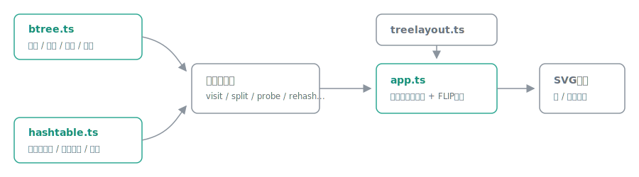

# structlab

[](https://github.com/miruky/structlab/actions/workflows/ci.yml)
[](https://www.typescriptlang.org/)
[](https://vitest.dev/)
[](https://opensource.org/licenses/MIT)

**B木とハッシュテーブルの内部状態を、キーを出し入れしながらSVGで観察できるプレイグラウンドです。**

## 概要

B木タブでは、キーの挿入・削除・検索のたびに、根から葉までの探索経路、満杯ノードの分割、キー不足時の兄弟からの借用とノード統合、根の縮退といった内部の動きが、構造図のハイライトと日本語の操作ログの両方に現れます。最小次数を t = 2 と t = 3 で切り替えると、同じキー列でも木の形がどう変わるかを見比べられます。ハッシュテーブルタブでは、チェイン法・線形走査法・二次走査法を切り替えながら、FNV-1aハッシュ値の計算、衝突、開番地法の墓石、走査の歩幅の違い、負荷率の上限超過による再ハッシュを観察できます。線形走査が連続クラスタを作るのに対し、二次走査が三角数の歩幅で散らす様子がそのまま見えます。

ハイライトの色語彙は構造図の下に凡例で示します。再生速度は3段階、表示テーマは 自動 / ライト / ダーク を選べ、どちらも選択を記憶します。

試す: https://miruky.github.io/structlab/

### なぜ作ったのか

B木の削除は教科書でも場合分けが多く、「どの場合に借用が起き、どの場合に統合が起きるのか」を文章だけで追うのは骨が折れます。ハッシュテーブルの墓石も、なぜ削除で空きに戻してはいけないのかは、走査が途切れる様子を見るのが一番早い。出来合いのアニメーションを眺めるのではなく、自分の手でキーを出し入れして構造の応答を確かめられる実験台が欲しくて作りました。

## 使い方

- タブでB木 / ハッシュテーブルを切り替えます(URLの `#btree` / `#hash` でも指定できます)
- B木: キー(0〜999)を入力して挿入・削除・検索。最小次数の変更は、それまでの挿入順を新しい木で再現します
- ハッシュテーブル: 文字列キーを入力して挿入・削除・検索。方式(チェイン法 / 線形走査法 / 二次走査法)の変更も挿入順を保って作り直します
- どの操作も、内部で起きたことが操作ログに1ステップずつ記録され、構造図には凡例つきのハイライトが流れます
- 右上で再生速度(遅い / 標準 / 速い)と表示テーマ(自動 / ライト / ダーク)を切り替えられます

## アーキテクチャ



データ構造本体は描画を知りません。挿入・削除・検索はそれぞれ「何が起きたか」を表すイベント列(visit / split / borrow / merge / probe / rehash など)を返し、UI側がそれを一定間隔で再生してSVGをハイライトします。ノードの移動はFLIPパターン(前回位置から新位置へCSS transformで遷移)で表現し、レイアウト計算は `treelayout.ts` が担います。データ構造の正しさはDOMと無関係にテストできます。

## 技術スタック

| カテゴリ   | 技術                           |
| :--------- | :----------------------------- |
| 言語       | TypeScript 5(strict)           |
| ビルド     | Vite 8                         |
| テスト     | Vitest 4 + happy-dom(78テスト) |
| リンタ     | ESLint + Prettier              |
| CI / CD    | GitHub Actions                 |
| 配信       | GitHub Pages                   |
| 実行時依存 | なし                           |

## プロジェクト構成

- `src/lib/btree.ts` — B木本体。CLRSの先割り挿入と、借用・統合を含む完全な削除
- `src/lib/hashtable.ts` — ハッシュテーブル本体。チェイン法・線形走査法・二次走査法、FNV-1a、墓石、再ハッシュ
- `src/lib/treelayout.ts` — B木のSVG座標計算。子は親のキー境界からぶら下がる
- `src/lib/theme.ts` — テーマ選択(自動 / ライト / ダーク)の解決ロジック
- `src/lib/settings.ts` — 再生速度の段階と間隔
- `src/app.ts` — タブ・コントロール・イベント再生・FLIPアニメーション・テーマ・速度
- `docs/architecture.svg` — アーキテクチャ図

## はじめ方

### 前提条件

- Node.js 20.19 以上(CI は 22 で検証)

### セットアップ

```bash
npm ci
npm run dev
```

### テストとlint

```bash
npm test
npm run lint
```

### ビルド

```bash
npm run build
```

GitHub Pagesへは `main` へのpushで自動デプロイされます。サブパス配信のため、ワークフローでは環境変数 `STRUCTLAB_BASE=/structlab/` を渡してViteの `base` を切り替えています。

## 設計方針

- **イベント駆動の可視化**: データ構造は操作の結果としてイベント列を返すだけで、DOMにもSVGにも依存しません。B木の不変条件(キーの整列、葉の深さの一致、キー数の上下限)は `validate()` で機械検査し、ランダムな挿入・削除をSetと突き合わせるファズテストで削除の全分岐を踏んでいます。
- **値を持たないキー集合**: 格納するのはキーだけです。値の管理は配置の観察には寄与しないため省き、その分ハッシュ値・負荷率・クラスタ長の表示に割いています。
- **モーションは補助、本体は状態**: アニメーションは `prefers-reduced-motion: reduce` ですべて無効化され、その場合も最終状態とログだけで操作の全容を追えます。再ハッシュ直後は古い位置のハイライトが新しい配置と食い違うため、個別ハイライトではなく全セルのフラッシュに切り替えています。

## ライセンス

[MIT](LICENSE)
